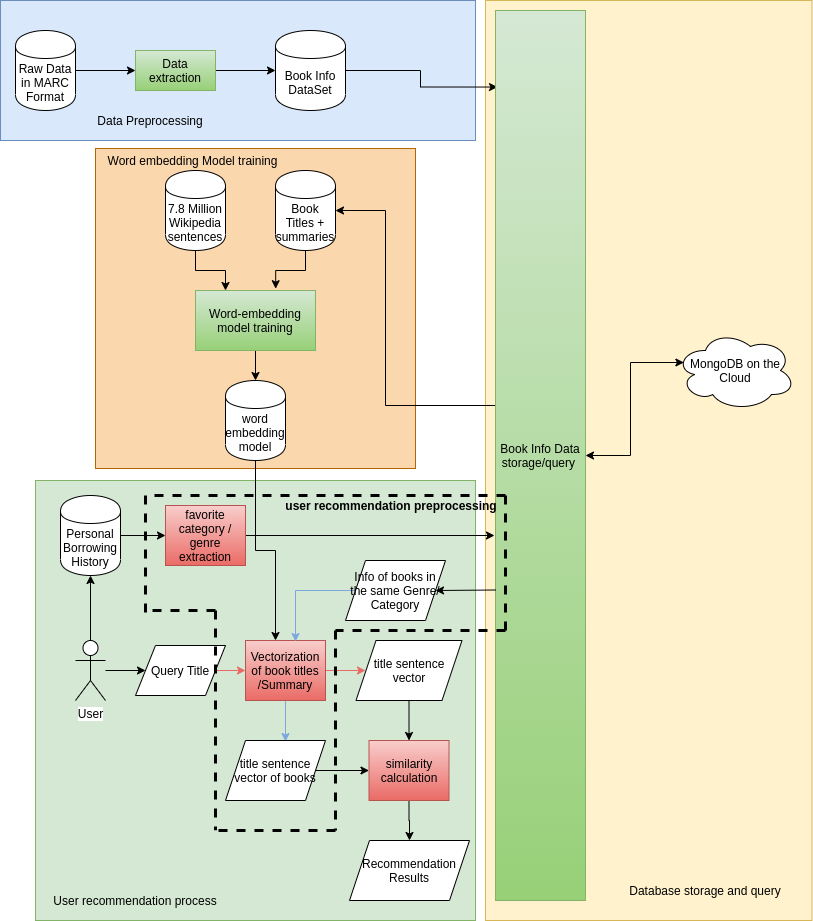
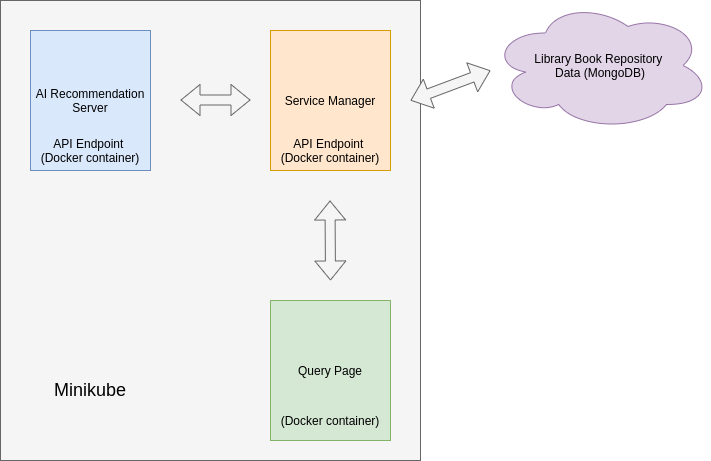

# AI-book-recommendation-system
An AI-based book recommendation-system for Hamilton Public Library aiming at enhancing the library experience of their users.

## Introduction

The project contains several different parts, including:
- Data Preprocessing
- Database Storage and Query
- Word Embedding Model Training
- User recommendation process

As shown in the following diagram:



A prototype was built to demonstrate the functionality of the system, comprising of 4 microservices running on Minikube/cloud (a Kubernetes for stand-alone machine)
- MongoDB database
- AI recommendation service
- Service Manager
- User Query Page

The block diagram of the demo system is shown below:




## Data Preprocessing
The code of `Data Preprocessing` is put under `data-processing/Marc`, running `extraction.py` will be able to extract the MARC-format dataset from HPL to `data/output_marc.csv` containing only required fields such as `BibID`, `ISBN`, `Author`, `Title`, `TopicalMain`, `TopicalGeographic`, `Summary`.

## Database Storage and Query
The code for `Database Storage` is put under the `data-processing/MongoDB`, running the `mongo.py` will be able to store the dataset to MongoDB.

The credentials of the MongoDB cloud server is stored in `data-processing/config.ini`, which will be deleted when I make this repository public.

One way to check the data stored in MongoDB server is to use `MongoDB Compass`- using the connection link `mongodb+srv://<user>:<password>@cluster0-n8hpa.gcp.mongodb.net/<db>?retryWrites=true&w=majority`  and replace entities in <> with corresponding credentials.

The code for `Database Query` is put under `manager/MongoDB`, a couple of different query functions were implemented.

## Word Embedding Model Training
The Word Embedding Model was trained using the [`sent2Vec`](https://github.com/epfml/sent2vec) built upon [Facebook's FastText library](https://github.com/facebookresearch/fastText).

7.8M Wikipedia sentences together with all the book titles and summaries of the library collection were used to train the model. The data can be found under `sent2vec/data/merged.txt`.

## Demo System Set Up
Besides different development tools, such as Python, Javascript and Vue, Docker and Minikube should also be installed.

Running the script `k8s/deploy-hpl.sh` will bring up the whole demo environment. (Please note that the minikube installation part of the script can only be used in Debian-based Linux such as Ubuntu, for other type of systems, the corresponding parts should be modified).

After the environment is set up, user can use `kubectl get pods -n hpl` to check the status of the pods of 3 microservices:
```
$ kubectl get pods
NAME                                             READY   STATUS    RESTARTS   AGE
hpl-ai-recommender-deployment-5cb865b66f-9mvfp   1/1     Running   0          13h
hpl-browser-deployment-75fd7b564b-26bt9          1/1     Running   0          13h
hpl-service-manager-deployment-c76d5d8bf-kk8k5   1/1     Running   0          13h
```
And use `kubectl get svc -n hpl`
```
$ kubectl get service
NAME                         TYPE        CLUSTER-IP       EXTERNAL-IP   PORT(S)          AGE
hpl-ai-recommender-service   ClusterIP   10.105.101.164   <none>        3518/TCP         17h
hpl-browser-service          NodePort    10.106.237.117   <none>        80:30080/TCP     17h
hpl-manager-service          NodePort    10.99.44.230     <none>        2354:32354/TCP   17h
```
Here we can see that the `Browser`'s port is forwarded to `port 30080` of the local machine, we can visit `localhost:30080` for the user query page.
The `service manager` is forward to port `32345`, we can visit `localhost:32345` to check the status of the `service manager`:
```
{
"message": "Manager status",
"state": "IDLE"
}
```
Also, we can use Postman to send message to communicate with `service manager`. If necessary, we can do the same thing to the `AI recommendation server`.